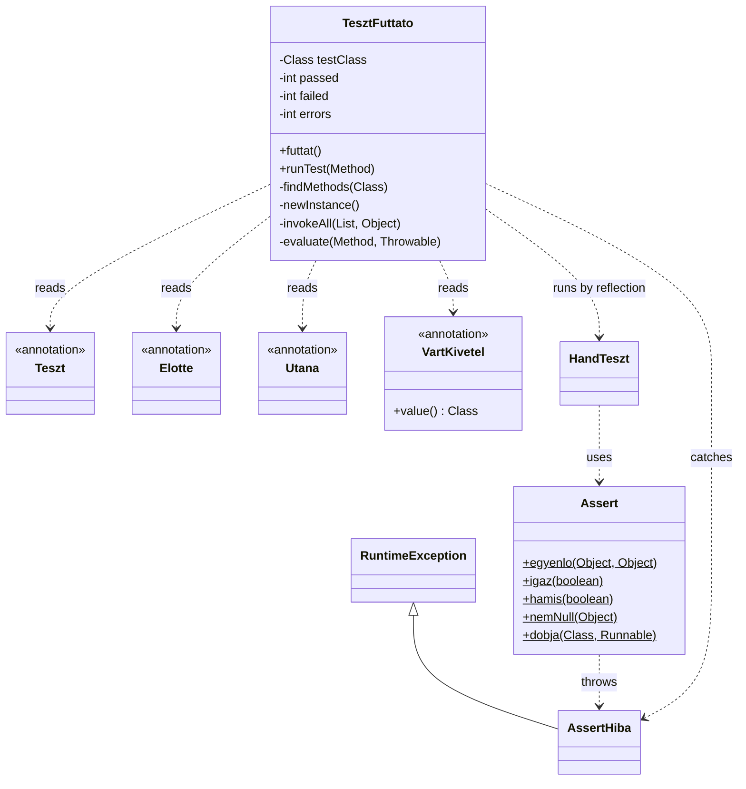

# UML class diagram

```mermaid
classDiagram
    class TesztFuttato {
        -Class testClass
        -int passed
        -int failed
        -int errors
        +futtat()
        +runTest(Method)
        -findMethods(Class)
        -newInstance()
        -invokeAll(List, Object)
        -evaluate(Method, Throwable)
    }
    class Assert {
        +egyenlo(Object, Object)$
        +igaz(boolean)$
        +hamis(boolean)$
        +nemNull(Object)$
        +dobja(Class, Runnable)$
    }
    class AssertHiba
    class RuntimeException
    class Teszt {
        <<annotation>>
    }
    class Elotte {
        <<annotation>>
    }
    class Utana {
        <<annotation>>
    }
    class VartKivetel {
        <<annotation>>
        +value() Class
    }
    class HandTeszt

    RuntimeException <|-- AssertHiba
    Assert ..> AssertHiba : throws
    TesztFuttato ..> Teszt : reads
    TesztFuttato ..> Elotte : reads
    TesztFuttato ..> Utana : reads
    TesztFuttato ..> VartKivetel : reads
    TesztFuttato ..> AssertHiba : catches
    TesztFuttato ..> HandTeszt : runs by reflection
    HandTeszt ..> Assert : uses
```